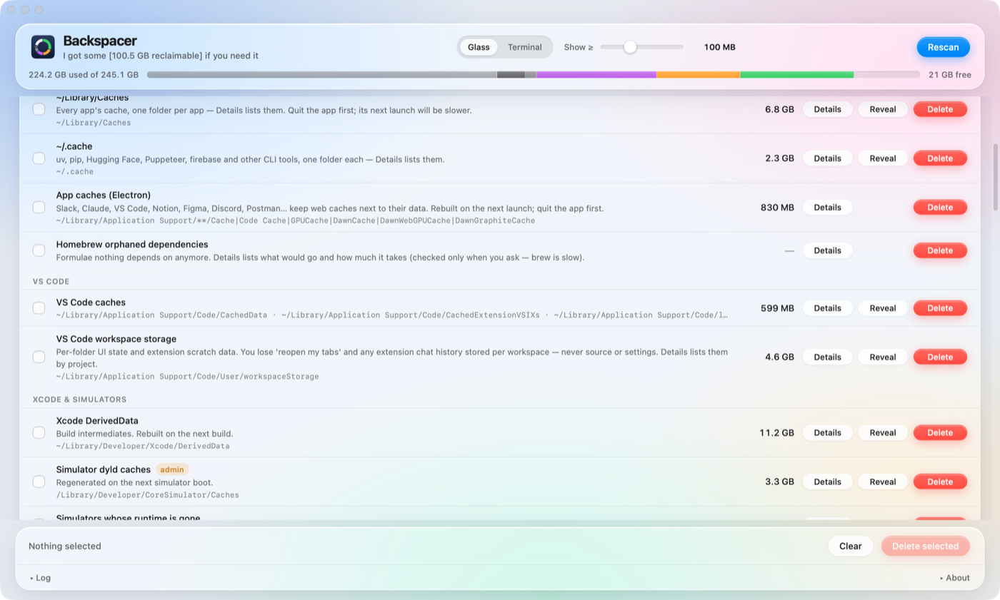

# Backspacer

[](https://github.com/anton-g-kulikov/backspacer/releases/latest)


[](https://github.com/anton-g-kulikov/backspacer/actions/workflows/ci.yml)
[](https://buymeacoffee.com/antonkulikov)
[](https://backspacer.dev)

A small macOS app that finds the caches, build output and tooling leftovers that
silently eat a developer's disk, sorts them by how safe they are to remove, and
deletes only what you select — after a confirmation that lists every item.

**[backspacer.dev](https://backspacer.dev)** · **[Download the latest release →](https://github.com/anton-g-kulikov/backspacer/releases/latest)**
Open the DMG, drag Backspacer to Applications. Notarized; no Gatekeeper warnings.
Or with Homebrew:

```bash
brew tap anton-g-kulikov/tap && brew install --cask backspacer
```



It grew out of a month of chasing "System Data" on a 245 GB MacBook Air. The
knowledge from that chase lives in `catalog.json`; the app is a thin, careful
shell around it.

Backspacer isn't an app uninstaller or a general disk cleaner. It is for the apps
and tools you keep: the caches, build output and downloads they pile up while you
use them. When you're done with an app,
[AppCleaner](https://freemacsoft.net/appcleaner/) is the best free way to remove
it together with everything it left behind.

## Buckets

| Bucket | Meaning | UI |
|---|---|---|
| `safe` | Caches and build output every app rebuilds on its own. No cost. | selectable, deletable |
| `regen` | Comes back on the next build/install. Costs one slow build. | selectable, deletable |
| `decide` | Real data or tooling — delete only what you no longer use. | selectable, deletable |
| `keep` | Needed for current work. Listed so the numbers add up. | read-only |
| `locked` | Managed by macOS: SIP-protected assets, or things macOS purges itself (Time Machine local snapshots). Deleting them gains nothing. | read-only |

Entries flagged `manual: true` are measured and explained but never deleted by
the app (e.g. "keep only the iOS DeviceSupport folder for your current phone").
Entries flagged `sudo: true` show an **admin** badge and go through macOS's own
password dialog.

## Safety model

- **The web layer never names a path.** Every disk operation takes a catalog
  entry *id*; `Bridge.swift` resolves it from the bundled `catalog.json`. A bug
  or injection in the UI cannot delete anything the catalog doesn't already
  describe.
- **`isSafeToDelete()`** is a second gate: refuses `/`, the home folder, every
  top-level visible folder in home, `~/Library` itself, anything outside `~/`,
  `/Library/Developer/` or the staged macOS update folder — and, at any depth,
  your data: Documents, Desktop, Pictures, Movies, Music, Photos libraries,
  Mail, Messages, Keychains, iCloud Drive, cloud-storage folders, Safari,
  `.ssh`, `.gnupg`. Symlinks are resolved first and names are compared
  case-insensitively. The one exception is a project folder you added
  yourself: what the globs find inside it (`node_modules`, `Pods`, build
  output) is yours to reclaim.
- **Updates, and nothing else, use the network.** Once a day (and after the first
  scan) the app fetches `backspacer.dev/appcast.xml` and, if there's a newer
  version, downloads the DMG from GitHub in the background — then asks before
  installing and relaunching; it never installs on its own. About (in the app menu) → *Check for
  updates automatically* turns the check off. Updates are verified against a key
  built into the app (Sparkle 2) on top of Apple's notarization. Nothing about you
  or your disk is sent.
- **Every delete goes through a confirmation** listing exactly what will go
  and how much. Nothing is removed by a single click.
- **Your call goes to the Trash; caches are removed for good.** Real data
  (archives, DeviceSupport, app data, workspaces) is moved to `~/.Trash`, so
  Finder's Put Back can undo it; the dialog says so and reminds you that the
  space is only freed once the Trash is emptied — the "Trash" entry in Safe
  to delete does that. Caches and build output are `rm`'d: parked in the
  Trash they would reclaim nothing. Admin paths and command-driven entries
  (`brew`, `simctl`) can't be trashed and are removed directly.
- **The size threshold hides, it doesn't just filter.** The "Show ≥" slider
  (10 MB … 10 GB, default 10 MB) removes smaller entries from the list, deselects them, and
  they can't be deleted until the slider is lowered again. Inside Details the same
  threshold applies; a last row says how many smaller items there are and how much
  they hold, and reveals them on click.
- **By project.** The Project folders island switches the build-output view from
  by tool to by project: one row per project under your folders, its `node_modules`,
  `Pods`, `.next`, build folders summed, and when it was last touched (last commit,
  or the newest source file) — stalest first, so a project you haven't opened in
  months is an easy call. Deleting a project's output leaves its source alone.
- **Nothing runs as root without the system dialog.** Admin items use
  `do shell script … with administrator privileges`, so the app never sees a
  password and there's no helper tool to trust.
- No App Sandbox (it can't delete outside its container). Hardened runtime is
  on, which is what notarization requires.

## Build from source

The source is published so you can check what the app does before trusting it
with your disk, build it yourself, and propose catalog entries.

Three parts, one door between them:

- `web/index.html` — the UI, plain HTML and JS. Runs inside a WKWebView in the
  app, or in any browser against a mock bridge.
- `Sources/Backspacer/Bridge.swift` — the only way from the page to the machine.
  Takes `{id, op, args}`, resolves catalog ids to paths, runs `du`, `find` and
  `rm`, asks for admin through the system dialog, opens the Full Disk Access
  pane. The page never names a path.
- `catalog.json` — what to scan, which bucket it belongs to, how to delete it,
  what to warn about.

**UI only** — no Xcode needed. The page falls back to a mock bridge with
random sizes when it isn't inside the app:

```bash
python3 -m http.server 8765      # from the repo root
open http://localhost:8765/web/index.html
```

**The app:**

```bash
scripts/build-app.sh             # → build/Backspacer.app, ad-hoc signed
open build/Backspacer.app
```

**Debugging the page.** Right-click → *Inspect Element* works in debug builds
(the WKWebView inspector). For a release build, turn it on once:

```bash
defaults write com.antonkulikov.backspacer WebInspector -bool YES
```

**Checks.** `swift build` compiles the bare binary. The tests:

```bash
swift test                              # Swift suites
npm ci && npm test                      # page logic, accessibility (static + axe-core), site
```

What they cover is in `Tests/test-documentation.md`.

**Adding an entry** is a JSON edit, validated by `catalog.schema.json` (your
editor picks it up from the `$schema` line; `swift test` checks it too). The fields:

```jsonc
{
  "id": "unique-id",                 // stable; the UI and bridge key on it
  "group": "Xcode & simulators",     // sub-heading inside the bucket
  "bucket": "safe",                  // safe | regen | decide | keep | locked
  "label": "Xcode DerivedData",
  "path": "~/Library/Developer/Xcode/DerivedData",   // or "paths": [...], or "glob": {...}
  "children": true,                  // list the path's subfolders as separately deletable items
  "childLabel": { "file": "workspace.json", "keys": ["folder"] },  // name each subfolder from a JSON or .plist file inside it
  "exclude": ["DiagnosticReports"],  // with children: subfolders never listed nor removed
  "companion": ".ini",               // with children: <stem>.ini is removed together with each child
  "note": "Rebuilt on next build.",  // optional, shown under the label
  "sudo": false,                     // needs admin to measure/delete
  "fda": false,                      // lives behind Full Disk Access: size shows "needs access" until granted
  "manual": false,                   // measure + explain, never delete
  "sizeCmd": "…",                    // optional: command printing size in KB
  "infoCmd": "xcrun simctl runtime list",  // optional: shown by the Details button
  "deleteCmd": "xcrun simctl erase all",   // optional: replaces rm -rf <path>
  "itemsCmd": "…",                   // optional: lists items as key<TAB>label<TAB>KB (Details shows them)
  "deleteItemCmd": "xcrun simctl erase {key}", // with itemsCmd: removes one item; {key} is shell-quoted
  "platforms": ["macos", "linux", "windows"], // optional: hosts that show the entry; absent = macOS only
  "os": { "linux": { "path": "$XDG_CACHE_HOME/pip" } }   // optional: per-OS location/command overrides
}
```

`platforms` and `os` prepare the catalog for other hosts (ADR-22); the macOS app
ignores `os` and shows an entry whenever `platforms` is absent or lists `macos`.
Paths in `os` blocks may use `$HOME`, `$XDG_CACHE_HOME`, `$XDG_CONFIG_HOME`,
`$XDG_DATA_HOME`, `$LOCALAPPDATA`, `$APPDATA` and `$TEMP`.

`glob` finds many paths: `{ "root": "$PROJECTS", "name": "node_modules", "maxdepth": 4, "type": "d" }`.
`$PROJECTS` stands for the user's project folders — detected from common names
(`~/Projects`, `~/Developer`, `~/code`, …) or chosen with **Add folder…** in
the app; any other `root` is a fixed path.
Entries with `glob`, `paths` or `children` list each match in the Details panel
with its size and its own Delete. Entries with a plain `path` and no `infoCmd`
show a size breakdown of what's inside.
Extras: `names` (several), `pathPatterns` (`find -path`), `then` (append a
sub-path to each match), `requireSibling` (`"*.csproj"` — only keep matches
whose parent contains such a file).

## Look

Two skins live in `web/index.html` as separate `<style>` sheets: **Glass**
(default; follows light/dark) and **Terminal**. Switch with the buttons in the
header or View → Glass / Terminal (⌘1 / ⌘2). The choice and the size threshold
are stored in `UserDefaults` (`ui.theme`, `ui.minSize`) through the bridge's
`prefGet` / `prefSet` ops, which accept only those two keys. In a browser,
`?theme=terminal` selects the skin. Keep and Managed-by-macOS start collapsed;
click any bucket header to toggle it.

## Full Disk Access

macOS blocks every process, root included, from reading some `~/Library`
folders (Safari, Mail, Messages, Containers of sandboxed apps) unless the app
has Full Disk Access. Backspacer detects this and shows a banner with a button
that opens the right System Settings pane. Grant it, then Rescan. Without it,
those entries under-report or show `?`.

## Contributing

Bug reports and catalog entries are the most useful things you can send —
see [CONTRIBUTING.md](CONTRIBUTING.md) for the five questions a good entry
answers, and [SECURITY.md](SECURITY.md) if it's about deleting the wrong thing.
Everyone is expected to follow the [code of conduct](CODE_OF_CONDUCT.md).

## Something went wrong?

Backspacer keeps a plain-text log of what it did in
`~/Library/Logs/Backspacer/Backspacer.log` — every scan and delete, the exact
commands it ran, failures, and page errors. About (app menu) → **Reveal log** opens it in
Finder. Attach it to an [issue](https://github.com/anton-g-kulikov/backspacer/issues)
or an email; note it names the folders and projects it measured.

## License

Free for noncommercial use under the
[PolyForm Noncommercial License 1.0.0](https://polyformproject.org/licenses/noncommercial/1.0.0)
— use it, share it, read and modify the source. Commercial use (selling it,
bundling it in a paid product, paid services) needs a separate license from
the author. The Backspacer name and icon aren't licensed: a modified build must
be renamed. Full text and details in [LICENSE](LICENSE).

If Backspacer got you your disk back, you can
[buy me a book](https://buymeacoffee.com/antonkulikov). Support:
anton.g.kulikov@gmail.com.
